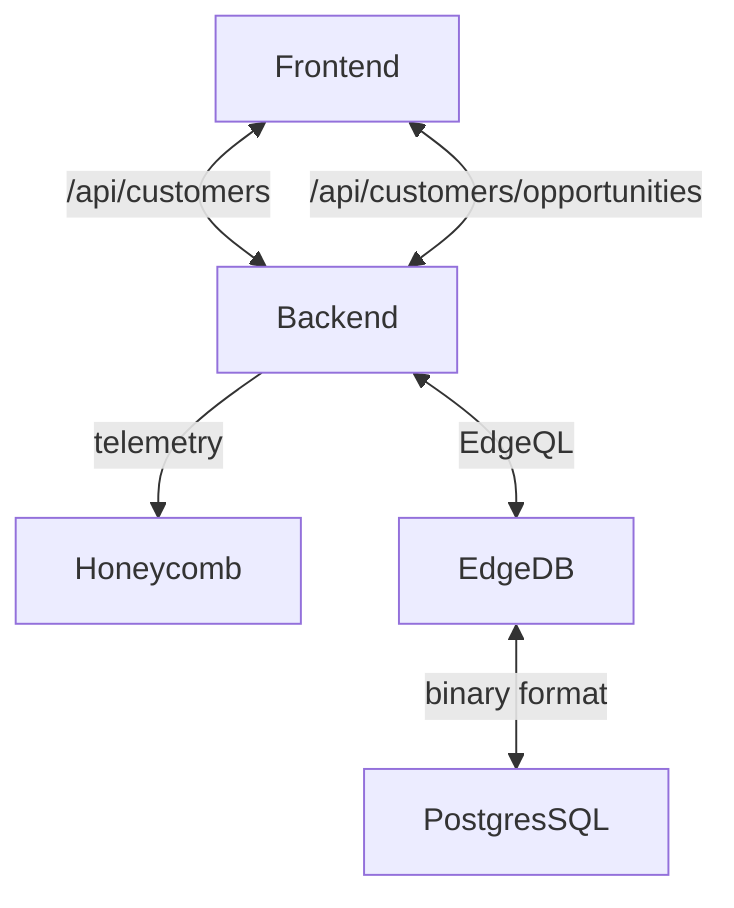
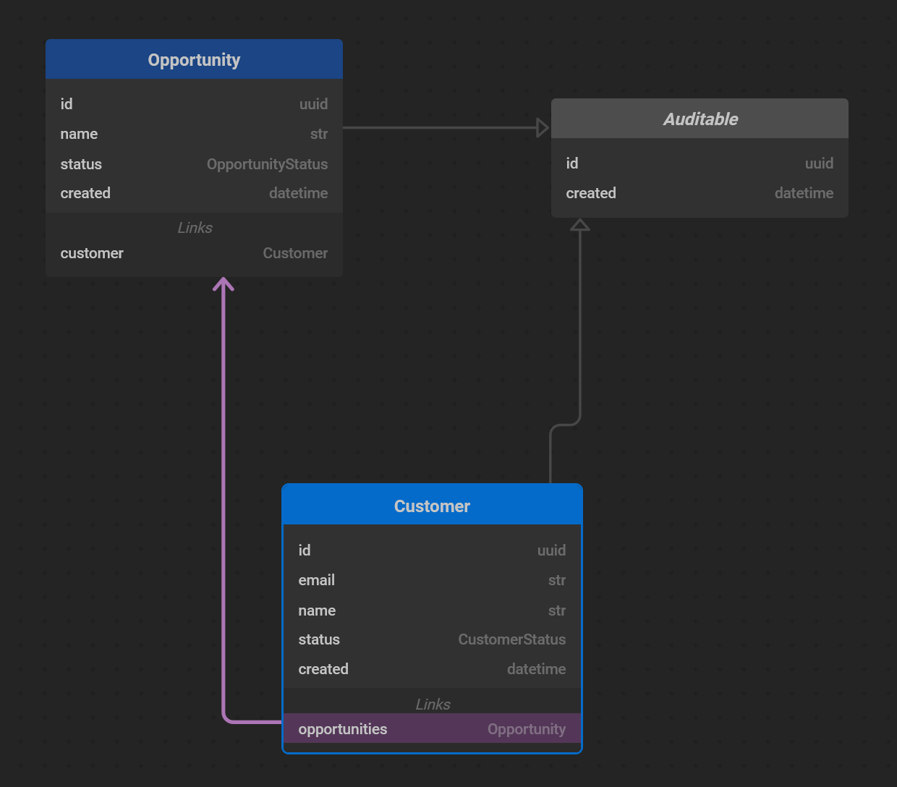

# Basic CRM

This project is to demonstrate a full stack application.

It is built 98% in Rust 🦀

To test it out go to <https://basiccrm.fly.dev>

## High level architecture

## Prerequisites

If you use vscode there are a bunch of recommended plugins in this repo.
I recommend you install them 😉

- Install rust <https://www.rust-lang.org/tools/install>
- Install trunk <https://trunkrs.dev/#install>
- Install edgedb <https://www.edgedb.com/install>
- For deployment install flyctl <https://fly.io/docs/hands-on/install-flyctl/>

## Frontend

---

The frontend is using the [Yew framework](https://yew.rs/) which is very similar to React but has some nice typesafety features like [typesafe routing](./frontend/src/routes.rs) and links that allow you to be sure that links are constructed correctly and that all routes have components assigned.

The [data folder](./frontend/src/data/) contains the data models for the api along with some helper funtions to call the api and serialize/deserialize the requests/responses. These data models are referenced in the backend so that changes to the models on the frontend will force mapping/updates within the backend.

For styling the project uses the [Bulma CSS framework](https://bulma.io/)

### Running the frontend

Vscode launch configs have been set up to run/debug the app but you can also run the following commands

`cd frontend`

`trunk serve` <-- this allows rebuild on file change

## Backend

---

The server is using [Axum](https://github.com/tokio-rs/axum) running in the tokio runtime. The main [server setup](./backend/src/main.rs) has the telemetry setup. Any panics will return a 500 and be marked as errors in Honeycomb.
The [customers.rs file](./backend/src/customers.rs) has the interaction with the EdgeDB database. Their client does the serialization and will fail if arguments are of the wrong type. I don't have any models that are not exposed to the client at the moment but they would live within the backend project.

### Running the backend

Vscode launch configs have been set up to run/debug the app but you can also run the following commands

`cd backend`

`cargo watch` <-- this allows rebuild on file change

## Data model

---

[The database schema](./backend/dbschema/default.esdl) contains the following relationships.
Updates to the schema can be made and migrations applied with the following commands.

`edgedb migration create`

`edgedb migrate`

## Hosting/deployment

---

The project is currently hosted on <https://fly.io> with postgres and edgedb in Sydney.

Before deployment you will need to update the frontend with the following command from the ./frontend directory `trunk build --dist ../backend/dist`

The docker image should be able to be deployed anywhere but you will need an edgedb to connect to, the following environment variables are needed for a deployment.

`EDGEDB_DSN=edgedbconnectionstring`

`HONEYCOMB_API_KEY=apikey`

---

## 🤔 Motivations

- Wanted a challenge to get something going end to end in Rust.
- Was curious about the database EdgeDB.
- Very keen on typesafety throughout the stack.
- I like the idea of using strict specification to reduce the amount of testing needed. This is part of the reason for choosing EdgeDB. Most of the rules of the system are encoded in the schema.

## 📝 Lessons

- Next time I would just use a react component library or similar fullstack create-react-app style application. Some of the ui interaction stuff is a little buggy or hard to use.
- This is probably not appropriate for dev teams without prior knowledge but it's going to catch up soon.

## ⚒️ TODO

- Hook up CI/CD with Github actions.
- Run DB migrations on startup.
- Get full stacktraces in Honeycomb when an error is thrown at the moment it's only the first message.
- More tests.
- Add some seed data for testing.
- Authentication/Authorization to track users and prevent missuse.
